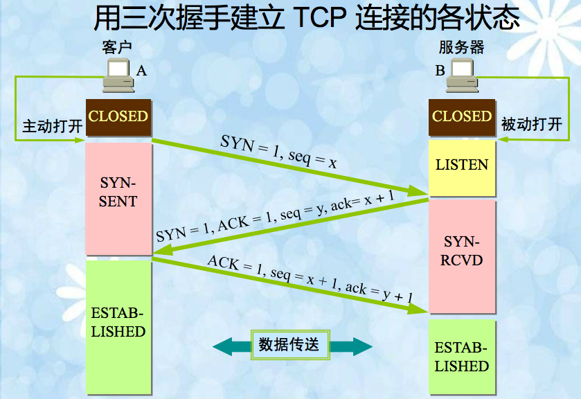
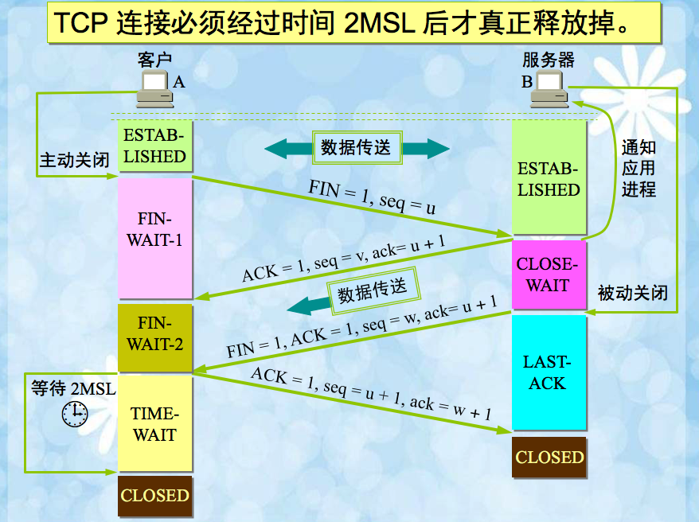
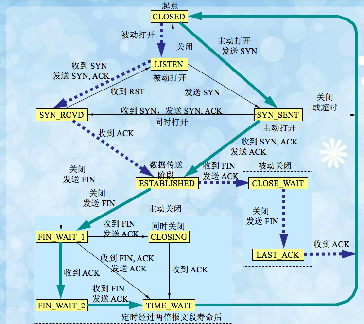

# 计算机网络总结
## 应用层
1.	域名系统DNS
	1.	域名解析过程：应用程序把待期待的域名放在DNS请求报文中，以UDP用户数据方式发给方式发本地域名服务器（使用UDP是为了减少开销），本地域名服务器在查找域名后，吧对应的IP地址放在回答报文中返回。应用进程获得目的主机的IP地址即可进行通信。
	2.	DNS规定：域名中的标号都由英文字母和数字组成，每一个标号不超过63个字符，也不区分大小写字母，标号中除连字符（-）外不能使用其他的标点符号，由多个标号组成的完整域名总共不超过255个字符。
	3.	域名分类：国家顶级域名（如.cn）、通用顶级域名（如.com）、基础结构域名/反向域名
	4.	域名查询方式：递归查询（主机向本地域名服务器的查询一般采用）、迭代查询（本地域名服务器向根域名服务器的查询一般采用）
2.	超文本传送协议HTTP
	1.	HTTP是面向事务的应用层协议
	2.	浏览页面的过程：
		1.	浏览器分析链接指向页面的URL
		2.	浏览器向DNS请求解析 www.baidu.com 的IP地址
		3.	域名系统DNS解析出百度的IP地址为61.135.169.121
		4.	浏览器与服务器建立TCP连接（在服务器端IP地址为61.135.169.121，端口号为80）
		5.	浏览器服务读取文件的命令：GET /index.html
		6.	服务器给出响应，将文件发送给浏览器
		7.	释放TCP连接
		8.	浏览器显示index.html中的所有文本
	3.	协议特点
		1.	http使用了面向连接的TCP作为运输层协议，保证了数据的可靠传输。
		2.	http协议本身是无连接的，换言之，http虽然使用了TCP连接，但通信的双方在交换http报文之前不需要先建立http连接
		3.	http协议是无状态的，用户每次访问都和用户第一次访问是一样的
	4.	http/1.1持续连接的两种工作方式
		1.	非流水线方式：客户收到前一个响应后才能发送下一个请求。
		2.	流水线方式：客户在收到http的响应报文之前就能够接着发送新的请求报文。
	5.	报文结构
		1.	请求报文
			请求行：方法+URL+版本
			首部行：首部字段名：值
			空行
			实体主体
		2.	响应报文
			状态行：版本+状态码+状态信息
			首部行：首部字段名：值
			空行
			实体主体
		3.	常见首部行的字段
			1.	请求报文：

			|字段（/值）|含义|
			|:--:|:--:|
			|host: localhost| #表示请求的服务器主机|
			|connect: keep-alive| # 表示持久连接|
			|cache-control: max-age = 0 |# 用于表示本地缓存时间|
			|user-agent|表示浏览器的信息|
			|accept-encoding| #可接受的压缩格式|
			|accept-language:|#可接受的的表示语言|
			|cookie:| #携带的cookie信息|
			|if-modified-since:|#询问所访问的信息是否已经修改|
			|if-none-match|#用于浏览器协商缓存|
			
			2.	响应报文
			
			|字段（/值）|含义|
			|:--:|:--:|
			|Server|表示服务器端信息|
			|Date|时间|
			|Content-Type|响应内容格式，例如text/html|
			|Content-Encoding|响应内容的压缩格式|
			|Last-Modified|响应的最后一次修改时间，用于协商缓存|
			|ETag|服务器为静态文件生成的标志，用于协商缓存|
			
		4.	常见状态码
			
			|状态码|关键字|含义|
			|:--:|:--:|:--:|
			|100|Continue|初始的请求已经接受，客户应当继续发送请求的其余部分|
			|101|Switching Protocols|服务器将遵从客户的请求转换到另外一种协议|
			|200|OK|一切正常，对GET和POST请求的应答文档跟在后面|
			|202|Accepted|已经接受请求，但处理尚未完成|
			|205|Reset Content|没有新的内容，但浏览器应该重置他所显示的内容。用来强制浏览器清除表单输入内容|
			|301|Moved Permanently|永久重定向|
			|302/307|Found|暂时重定向|
			|304|Not Modified|客户端有缓冲的文档并发出了一个条件性的请求，服务器告诉客户，原来缓存的文档还可以继续使用|
			|400|Bad Request|请求出现语法错误|
			|403|Forbidden|资源不可用|
			|404|Not Found|无法找到指定位置的资源|
			|405|Method Not Allowed|请求方法（post、get、head等）对指定的资源不适用|
			|408|Request Timeout|在服务器许可的等待时间内，客户一直没有发出任何请求，客户可以再以后重复同一请求|
			|414|Request URI Too Long|URI太长|
			|500|Internal Server Error|服务器遇到了意料不到的情况，不能完成客户的请求|
			|502|Bad Gateway|服务器作为网关或者代理时，为了完成请求访问下一个服务器，但该服务器返回非法的请求|
			|503|Service Unavailable|服务器由于维护或者负载过重未能应答|
			
	6.	http请求报文的一些方法
	
		|方法（操作）|意义|
		|:--:|:--:|
		|OPTION|请求一些选项的信息|
		|GET|请求读取有URL所标志的信息|
		|HEAD|读取由URL所标志的信息的首部|
		|POST|给服务器添加信息|
		|PUT|在指明的URL下存储一个文档|
		|DELETE|删除指明的URL所标志的资源|
		|TRACE|用来进行环回测试的请求报文|
		|CONNECT|用于代理服务器|
		
	7.	状态码
		|状态码|含义|
		|:--|:--|
		|1xx |表示通知信息的，如收到了或正在进行处理|
		|2xx |表示成功|
		|3xx |表示重定向|
		|4xx |表示客户端错误|
		|5xx |表示服务器错误|
## 运输层
	1.	运输层协议概述
		1.	从通信和信息处理的角度看，运输层向它上面的应用层提供通信服务，它属于通信部分的最高层，同时也是用户功能的最低层。
		2.	网络层是为主机之间提供逻辑通信，而运输层为应用程序提供端到端的逻辑通信。
	2.	UDP用户数据报协议
		1.	特点：
			1.	UDP是无连接的
			2.	UDP使用尽最大努力交付，即不保证可靠传输
			3.	UDP是面向报文的。发送方的UDP对应用程序交下来的报文，在添加首部后就向下交付IP层，UDP对应用层交下来的报文，既不合并，也不拆分，而是保留这些报文的边界。
			4.	UDP没有拥塞控制，因此网络出现的拥塞不会使源主机的发送速率降低
			5.	UDP支持一对一、一对多、多对一和多对多的交互通信
			6.	UDP的首部开销小，只有8个字节
	3.	TCP传输控制协议
		1.	特点
			1.	TCP是面向连接的运输层协议
			2.	每一条TCP连接只能有两个端点，每一条TCP连接都是点对点的
			3.	TCP提供可靠交付的服务
			4.	TCP提供全双工通信
			5.	面向字节流
		2.	连续ARQ协议（TCP协议的精髓所在）
			1.	连续ARQ协议规定，发送方每收到一个确认，就把发送窗口向前滑动一个分组的位置
			2.	接受方一般都采用累积确认的方式，这就是说，接收方不必对收到的分组逐个发送确认，而是在收到几个分组确认后，对按序到达的最后一个分组发送确认
			3.	滑动窗口
				1.	发送缓存用来暂时存放：
				(1）发送应用程序传送给发送方TCP准备发送的数据
				(2)	TCP已发送出但尚未收到确认的数据
				2.	接收缓存用来存放：
				(1)	按序到达的、但尚未被接收应用程序读取的数据；
				(2)	未按序到达的数据
		3.	流量控制
			1.	通过滑动窗口实现流量控制
				1.	流量控制就是让发送方的发送速率不要太快，要让接收方来得及接收
				2.	发送方的发送窗口不能超过接收方给出的接收窗口（通过接收窗口rwnd字段控制）的数值
		4.	拥塞控制
			1.	拥塞控制就是防止过多的数据注入网络，这样可以使网络中的路由器或链路不致过载
			2.	几种拥塞控制方法
				1.	慢开始和拥塞控制
				(1)	发送方维持一个拥塞窗口（cwnd）的状态变量，拥塞窗口的大小取决于网络的拥塞程度，并且动态的在变化。发送方让自己的发送窗口等于拥塞窗口
				(2)	拥塞窗口的大小先从1开始，然后每经过一个传输轮次，拥塞窗口cwnd就加倍
				(3)	慢开始门限（ssthresh）：
				a.	当cwnd<ssthresh时，使用上述的慢开始算法。
				b.	当cwnd=ssthresh时，既可以使用慢开始算法，又可以使用拥塞控制算法  
				c.	当cwnd>ssthresh时，使用拥塞控制算法  
				(4)	无论在慢开始阶段还是在拥塞避免阶段，只要发送方判断网络出现拥塞，就把慢开始门限设置为出现拥塞是的发送窗口值的一半（但不能小于2）
				(5)	慢开始算法当网络出现超时时（即出现拥塞），拥塞窗口就重新设置为1，重新开始执行慢开始算法。
				2.	快重传和快恢复
				(1)	快重传算法首先要求接收方每收到一个失序的报文端后就立即发出重复确认，当发送方一连收到三个重复确认后就应当立即重传对方尚未收到的报文端。
				(2)	与快重传配合使用的还有快恢复算法，其过程有两个特定：
					- 当发送方连续收到三个重复确认是，就执行"乘法减小"算法，把慢开始门限ssthresh减半。这是为了预防网络发生拥塞。
					- 把cwnd值设置为慢开始门限ssthresh减半后的数值，然后开始执行拥塞避免算法（“加法增大”），使拥塞窗口缓慢地线性增大。
		5.	TCP的传输连接管理
			1.	三次握手
			
			2.	四次挥手
			
			3.	状态转换图
			
## 网络层
	1.	概述：网络层向上值提供简单灵活的、无连接的、尽最大努力交付的数据报服务，网络层不提供服务质量的承诺
	2.	IP地址分类
		A类：网络号（0+7位）+主机号（24位）
		B类：网络号（10+14位）+主机号（16位）
		C类：网络号（110+21位）+主机号（8位）
		D类：1110+28位：多播地址
		E类：1111+28位：保留为今后使用
	3.	地址解析协议ARP：根据IP地址找出相应的硬件地址，解决同一个局域网上的主机或者路由器的IP地址和硬件地址的映射问题
	4.	网际控制报文协议ICMP
		1.	种类：ICMP差错报告报文和ICMP询问报文，报文的前三个字段分别是类型、代码和检验和
	5.	路由选择协议
		1.	路由选择协议分为两大类：
		(1)	内部网关协议IGP（Interior Gateway Protocol）,主要包含RIP和OSPF；
		(2)	外部网关协议EGP（External Gateway Protocol），主要包括BGP-4
		2.	内部网关协议RIP：基于距离向量的路由选择协议，最大优点是简单。
			1.	特点
			(1)	仅和相邻路由器交换信息
			(2)	路由器交换的信息是当前本路由器所知道的全部信息，即自己的路由表。
			(3)	按固定的时间间隔交换路由信息
			2.	优缺点
			(1)	优点：实现简单，开销较小
			(2)	缺点：好消息传播的快，坏消息传播的慢
		3.	内部网关协议OSPF（开放最短路径优先）
			1.	与OSPF的区别
			(1)	向本自治系统中所有路由器发送信息，使用泛洪法。
			(2)	发送的信息就是与本路由器相邻的所有路由器的链路状态，但这只是路由器所知道的部分信息。
			(3) 只有当链路状态发生变化是，路由器才向所有路由器用泛洪法发送此消息
			2.	优点：更新过程收敛的快。
## 数据链路层
	1.	链路是一个节点到相邻节点的一段物理线路，数据链路则是在链路的基础上增加了一些必要的硬件（如网卡）和软件（如协议的实现）
	2.	数据链路层传送的协议数据单元是帧，三个基本问题是：封装成帧、透明传输和差错检测。
	3.	局域网的优点是：具有广播功能，从一个站点可很方便的访问全网；便于系统的扩展和逐渐的演变；提高了系统的可靠性、可用性和生存性
	4.	以太网的硬件地址，即MAC地址实际上就是适配器地址或适配器标识符，与主机所在的地点无关。源地址和目的地址都是48位长。
	5.	以太网采用的协议是CSMA/CD，协议的要点是：发送前先监听，边发送边监听，一旦发现总线上发生了碰撞，就立即停止发送。然后采用退避算法等待一段随机时间后再次发送。因此，每一个站在自己发送数据之后的一小段时间内，存在着遭遇碰撞的可能。
## 物理层
	1.	物理层的主要任务就是确定与传输媒体的接口有点的一些特性，如机械特性、电气特性、功能特性和过程特性。
## 概述
	1.	英特网的组成
		1.	从其工作方式上看，可以划分为两大部分，
		(1)	边缘部分：有所有连接在英特网上的主机组成。这部分是用户直接使用的，用来进行通信和资源共享
		(2)	核心部分：由大量网络和连接这些网络的路由器组成。这部分是为边缘部分提供服务的。
	2.	体系结构
		1.	OSI七层结构：物理层、数据链路层、网络层、运输层、会话层、表示层、应用层
		2.	TCP/IP四层结构：应用层（TELNET/FTP/SMTP等）、运输层（TCP/UDP）、网际层IP、网络接口层
		3.	五层协议的体系结构：应用层、运输层、网络层、数据链路层、物理层
	3.	各层作用
		1.	应用层：通过进程见的交互来完成特定网络应用。
		2.	运输层：负责两个主机中进程之间的通信提供通用的数据传输服务。
		3.	网络层：负责为分组交换网上的不同主机提供通信。
		4.	数据链路层：传输单位为帧。
		5.	物理层：传输数据的单位是比特。
		
